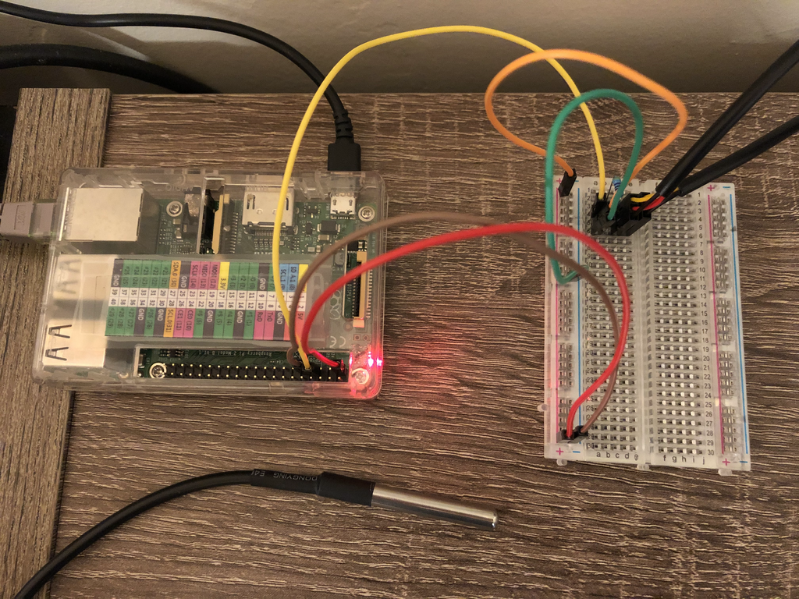

# Simple C programs with two sensors and for CPU temperature

This is the simple and modified example which can read two ds18b20 sensors attached to the Rasberry Pi through sysfs. The original code is located in the [1] site. In addition, the simple program can read one CPU temperature.


## DS18B20

I bought the IZOKEE 5 Pack DS18B20 Temperature Sensor Digital Thermal Stainless Steel Tube at Amazon. That is the most cheapest one which I've found. And two sensors are used for this demo.

||
| :---: |
|**Figure 1** Raspberry Pi 2 with two 1-Wire sensors.|


## CPU (Thermal Zone) Temperature

Generic Thermal Sysfs proivdes a thermal zone temperature as millidegree Celsius [2]. Each system may have multiple `thermal_zone` in `/sys/class/thermal/` path. We may say this temperature is a CPU temperature if the thermal zone type is `x86_pkg_temp`, `cpu-thermal` or similar one.

### `Intel(R) Core(TM) i5-4570R CPU @ 2.70GHz`

```bash
$ cat -n /sys/class/thermal/thermal_zone*/type
     1	x86_pkg_temp
```
### `ARMv7 Processor rev 5 (v7l)`

```bash
$ cat -n /sys/class/thermal/thermal_zone*/type
     1	cpu-thermal
```

## Build

```bash
$ make
$ sudo ./1WireBin 
 rom[0]: 28-0301a279e7d9
 rom[1]: 28-3c01d6079a0d
>> Mon Nov  2 22:03:42 2020
>>        0 Sensor 28-0301a279e7d9 temperature [0] : 28.500 °C
>>        0 Sensor 28-3c01d6079a0d temperature [1] : 25.125 °C
>> Mon Nov  2 22:03:44 2020
>>        1 Sensor 28-0301a279e7d9 temperature [0] : 28.500 °C
>>        1 Sensor 28-3c01d6079a0d temperature [1] : 25.187 °C


$ sudo ./ThermalZone 
>> Sat Nov  7 15:16:01 2020
>>        0 Thermal Zone temperature : 39.008 °C 102.214 F
>> Sat Nov  7 15:16:02 2020
>>        1 Thermal Zone temperature : 39.008 °C 102.214 F
>> Sat Nov  7 15:16:03 2020
>>        2 Thermal Zone temperature : 37.932 °C 100.278 F
>> Sat Nov  7 15:16:04 2020

$ sudo ./ThermalZone 
>> Sat Nov  7 15:02:35 2020
>>        0 Thermal Zone temperature : 57.000 °C 134.600 F
>> Sat Nov  7 15:02:36 2020
>>        1 Thermal Zone temperature : 56.000 °C 132.800 F
```

### Rules

```bash
make
make clean
make distclean
```

## References
[1] https://www.waveshare.com/wiki/Raspberry_Pi_Tutorial_Series:_1-Wire_DS18B20_Sensor

[2] https://www.kernel.org/doc/Documentation/thermal/sysfs-api.txt
